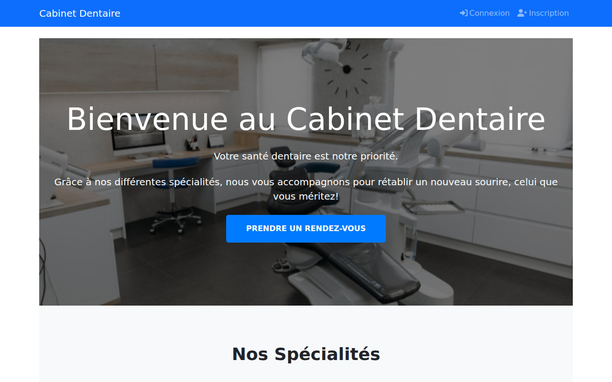
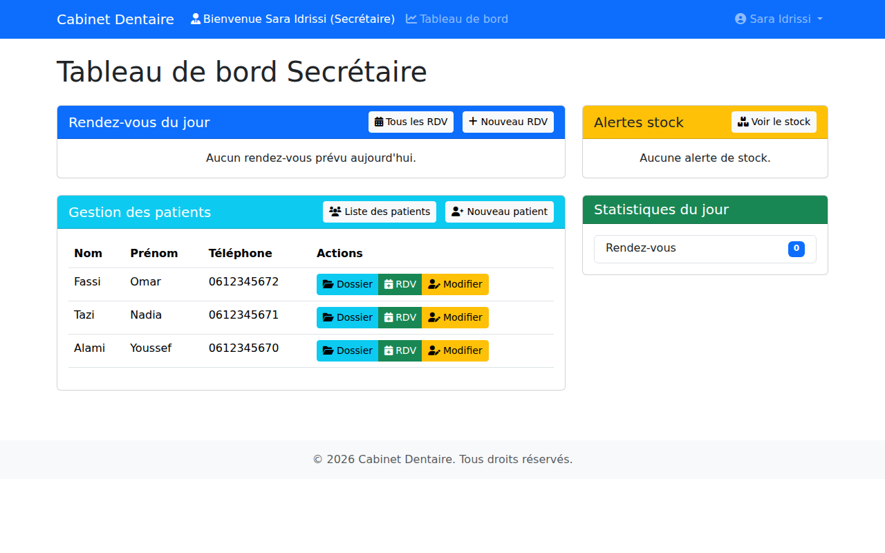
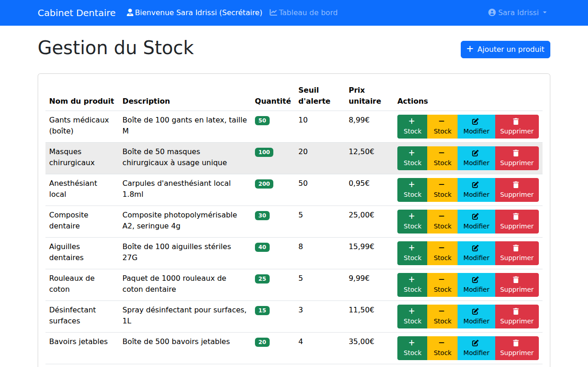
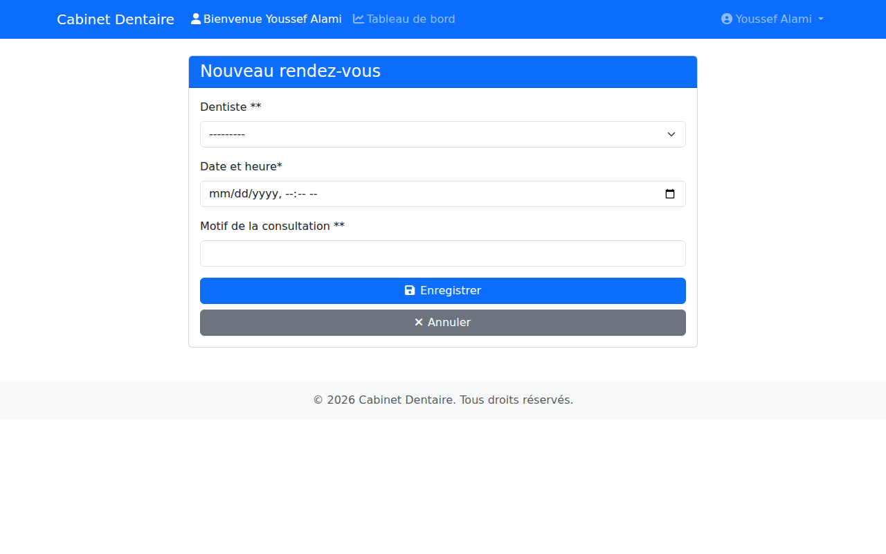

# 🦷 Cabinet Dentaire

[](https://github.com/axhraf40/cabinet-dentaire/actions/workflows/ci.yml)


Application web de gestion d'un cabinet dentaire, développée avec Django : prise de rendez-vous en ligne, dossiers patients, consultations, facturation et gestion du stock, avec un espace dédié pour chaque rôle (patient, dentiste, secrétaire).



## Fonctionnalités

| Rôle | Ce qu'il peut faire |
|---|---|
| **Patient** | S'inscrire, prendre et annuler un rendez-vous, consulter son historique et ses factures, modifier son profil |
| **Dentiste** | Voir ses rendez-vous, consulter les dossiers patients, enregistrer une consultation (facture créée automatiquement), gérer les secrétaires |
| **Secrétaire** | Gérer les patients, fixer le montant et le paiement des rendez-vous, gérer les factures, le stock et les mouvements de stock |

Paiement par carte via Stripe (optionnel, nécessite des clés Stripe).

## Captures d'écran

| Tableau de bord secrétaire | Gestion du stock |
|---|---|
|  |  |

| Prise de rendez-vous |
|---|
|  |

## Technologies

- Python 3.12+ / Django 5.2 LTS
- SQLite
- Bootstrap 5, Font Awesome, django-crispy-forms
- Stripe (paiement en ligne)

## Installation

### Windows (rapide)

Dans le dossier du projet, double-cliquer sur `lancer.bat` (ou taper `.\lancer.bat` dans PowerShell). Il crée l'environnement virtuel, installe les dépendances, prépare la base de données et ouvre http://127.0.0.1:8000.

### Manuel (Windows, Linux, macOS)

```bash
git clone https://github.com/axhraf40/cabinet-dentaire.git
cd cabinet-dentaire
python -m venv venv
# Windows : venv\Scripts\activate    Linux/macOS : source venv/bin/activate
pip install -r requirements.txt
cp .env.example .env          # Windows : copy .env.example .env
python manage.py migrate
python manage.py init_cabinet_info
python manage.py create_sample_products
python manage.py createsuperuser
python manage.py runserver
```

Puis ouvrir http://127.0.0.1:8000.

Les comptes **dentiste** et **secrétaire** se créent depuis l'administration (`/admin`) avec le compte superutilisateur. Les patients s'inscrivent eux-mêmes depuis le site.

## Configuration

Les variables sont lues depuis un fichier `.env` à la racine (modèle : [`.env.example`](.env.example)).

| Variable | Rôle | Défaut |
|---|---|---|
| `DJANGO_SECRET_KEY` | Clé secrète Django — **obligatoire** quand `DJANGO_DEBUG=False` | clé de développement |
| `DJANGO_DEBUG` | `True` en développement, `False` en production | `True` |
| `DJANGO_ALLOWED_HOSTS` | Hôtes autorisés, séparés par des virgules | `127.0.0.1,localhost` |
| `STRIPE_PUBLIC_KEY` / `STRIPE_SECRET_KEY` | Clés Stripe pour le paiement par carte | vide |

## Sécurité

- Aucune clé ni mot de passe n'est stocké dans le code : tout passe par `.env`.
- `.env`, la base `db.sqlite3`, le dossier `media/` (fichiers envoyés par les utilisateurs) et `venv/` sont exclus par [`.gitignore`](.gitignore).
- En production (`DJANGO_DEBUG=False`), l'application refuse de démarrer sans `DJANGO_SECRET_KEY`.
- La CI exécute [gitleaks](https://github.com/gitleaks/gitleaks) à chaque push pour détecter toute clé commitée par erreur.

## Tests

```bash
python manage.py test gestion_cabinet
```

Les tests couvrent le parcours complet : inscription d'un patient, prise de rendez-vous, consultation par le dentiste, facture, paiement et stock côté secrétaire, ainsi que les restrictions d'accès. Ils sont lancés automatiquement par GitHub Actions sur Python 3.12 et 3.13.

## Structure

```
cabinet_dentaire/      configuration Django (settings, urls)
gestion_cabinet/       application principale
├── models.py          patients, dentistes, secrétaires, rendez-vous, factures, stock
├── views.py           pages et logique métier
├── forms.py           formulaires
├── management/        commandes init_cabinet_info et create_sample_products
└── tests.py           tests
templates/             pages HTML
static/                CSS, JS, images
docs/screenshots/      captures d'écran du README
lancer.bat             lancement en un clic sous Windows
```

## Limites connues

Les pages `/contact/`, `/services/`, `/equipe/`, `/dentistes/` et le détail d'un rendez-vous n'ont pas encore de template HTML. Aucun lien du site n'y mène.

## Licence

Distribué sous licence MIT — voir [LICENSE](LICENSE).
